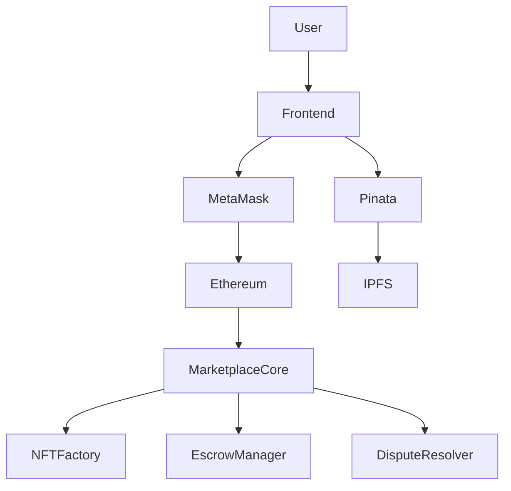

# 🛒 MINTEX — Decentralized Marketplace (Web3 dApp)

[](https://soliditylang.org/)
[](https://hardhat.org/)
[](https://ethereum.org/)
[](https://nextjs.org/)
[](https://metamask.io/)
[](https://ipfs.tech/)
[](https://openzeppelin.com/)
[]()
[]()

---

# 📖 Overview

MINTEX is a decentralized marketplace (Web3 dApp) that enables users to tokenize physical products as NFTs and trade them securely without relying on centralized intermediaries.

The platform combines Ethereum smart contracts, decentralized storage and a modern React frontend to provide a complete Web3 experience. Every purchase is protected through an escrow mechanism, while disputes can be resolved using a dedicated arbitration smart contract.

This project was developed as my **Bachelor's Thesis in Computer Engineering** at the **University of the Basque Country (UPV/EHU)**.

### Project Highlights

- 🧩 4 interconnected smart contracts
- 🖼️ ERC-721 NFT implementation
- 🔒 Escrow-based payment protection
- 🌐 IPFS decentralized storage
- ⛓️ Ethereum Sepolia deployment
- ✅ 25 automated unit tests

---

# ✨ Key Features

- Mint physical products as ERC-721 NFTs.
- Buy and sell products through a decentralized marketplace.
- Secure payments using an escrow smart contract.
- Built-in dispute resolution workflow.
- Upload product images and metadata to IPFS.
- Wallet authentication through MetaMask.
- Deploy and interact with contracts on Ethereum Sepolia.
- Modern responsive interface built with Next.js.

---

# 🏗️ Architecture



The application is composed of four modular smart contracts, each responsible for a specific part of the business logic.

| Smart Contract | Responsibility |
|----------------|----------------|
| NFTFactory | ERC-721 NFT creation and ownership |
| MarketplaceCore | Marketplace business logic |
| EscrowManager | Escrow payment management |
| DisputeResolver | Dispute arbitration |

Ownership of `EscrowManager` and `DisputeResolver` is transferred to `MarketplaceCore`, ensuring that only the marketplace contract can execute critical operations.

---

# 📡 Deployed Contracts (Sepolia Testnet)

| Contract | Address |
|-----------|---------|
| NFTFactory | [`0xd40c4111...`](https://sepolia.etherscan.io/address/0xd40c4111f656a6245b75b76eea3e2f33816c35d9) |
| EscrowManager | [`0x28df8dae...`](https://sepolia.etherscan.io/address/0x28df8daee3828ee2dda06bc7d1359071de5f588d) |
| DisputeResolver | [`0x5ea01688...`](https://sepolia.etherscan.io/address/0x5ea0168858b07da2ce26640a3b835220757c5ab2) |
| MarketplaceCore | [`0x4ad41da2...`](https://sepolia.etherscan.io/address/0x4ad41da27a2f49e1d3d40d170bc103a9fe2c7221) |

---

# 🔐 Smart Contract Workflow

1. Seller connects MetaMask.
2. Product image is uploaded to IPFS through Pinata.
3. Product metadata is stored on IPFS.
4. Seller mints an ERC-721 NFT.
5. Product is listed on the marketplace.
6. Buyer purchases the product.
7. Funds are locked inside Escrow.
8. Buyer confirms delivery.
9. Escrow releases payment to the seller.

If a dispute is opened:

- Buyer submits a claim.
- Administrator reviews the case.
- Escrow releases funds to the appropriate party.

---

# 🌐 Frontend

The frontend was developed using **Next.js App Router** and provides a complete Web3 user experience.

Main features include:

- MetaMask wallet connection
- Marketplace browsing
- NFT creation
- Product listings
- Purchase flow
- User profile
- Purchase history
- Seller dashboard
- Administrator panel

---

# 💾 Decentralized Storage

Images and metadata are stored off-chain using IPFS.

```
Product Image
      │
      ▼
   Pinata API
      │
      ▼
     IPFS
      │
      ▼
 Content Identifier (CID)
      │
      ▼
Stored inside Smart Contract
```

Only immutable IPFS references are stored on-chain, reducing gas costs while maintaining decentralization.

---

# 🚀 Quick Start

## Clone the repository

```bash
git clone https://github.com/Oierunanuee/decentralized-marketplace.git
```

---

## Install Smart Contracts

```bash
cd hardhat
npm install
```

Create `.env`

```env
SEPOLIA_RPC_URL=...
PRIVATE_KEY=...
```

Compile

```bash
npx hardhat compile
```

Deploy

```bash
npx hardhat run scripts/deploy.ts --network sepolia
```

Run tests

```bash
npx hardhat test
```

---

## Install Frontend

```bash
cd frontend
npm install
```

Create `.env.local`

```env
PINATA_JWT=...
NEXT_PUBLIC_PINATA_JWT=...
NEXT_PUBLIC_PINATA_GATEWAY=https://gateway.pinata.cloud

NEXT_PUBLIC_RPC_URL=...
```

Start development server

```bash
npm run dev
```

---

# 📡 User Workflow

### Seller

- Connect MetaMask
- Upload product image
- Mint NFT
- Publish marketplace listing

### Buyer

- Browse products
- Purchase NFT
- Funds locked in Escrow
- Confirm delivery

### Administrator

- Review disputes
- Resolve conflicts
- Release or refund escrow

---

# 🧪 Testing

The project includes **25 automated unit tests** covering all core smart contract functionality.

### Tested Components

✅ NFTFactory

- NFT minting
- Ownership verification
- Invalid token handling

✅ MarketplaceCore

- Listing creation
- Product purchase
- Access control
- Price validation
- Listing validation

✅ EscrowManager

- Escrow creation
- Payment release
- Refund process
- Ownership restrictions

✅ DisputeResolver

- Open disputes
- Resolve disputes
- Prevent duplicate disputes

Tests were developed using **Hardhat** and cover both successful and failure scenarios.

---

# 📁 Project Structure

```
decentralized-marketplace/

├── frontend/
│   ├── app/
│   ├── components/
│   ├── hooks/
│   ├── lib/
│   └── public/
│
├── hardhat/
│   ├── contracts/
│   ├── ignition/
│   ├── scripts/
│   ├── test/
│   └── hardhat.config.ts
│
├── docs/
│
├── README.md
└── LICENSE
```

---

# 🛠️ Technology Stack

| Technology | Purpose |
|------------|---------|
| Solidity | Smart Contract Development |
| Hardhat | Development Framework |
| OpenZeppelin | ERC-721 Implementation |
| Next.js | Frontend |
| React | User Interface |
| Wagmi | Wallet Integration |
| Viem | Ethereum Communication |
| MetaMask | Authentication |
| IPFS | Decentralized Storage |
| Pinata | IPFS Pinning |
| Sepolia | Ethereum Testnet |
| Alchemy | RPC Provider |

---

# 📚 Lessons Learned

During this project I gained practical experience with:

- Smart contract development using Solidity.
- Modular blockchain architecture design.
- ERC-721 NFT implementation.
- Escrow-based payment systems.
- Web3 frontend development using Next.js.
- Wallet integration with MetaMask.
- Decentralized storage using IPFS.
- Deploying contracts on Ethereum Sepolia.
- Automated testing using Hardhat.
- Designing secure ownership and permission models.

---

# 🔮 Future Improvements

Potential future enhancements include:

- Multi-chain deployment.
- ERC-1155 support.
- DAO governance.
- User reputation system.
- Upgradeable smart contracts.
- CI/CD using GitHub Actions.
- Cloud deployment.
- Mobile application.

---

# 📄 License

This project is distributed under the MIT License.

---

# 🎓 Academic Context

This project was developed as the **Bachelor's Thesis** for the **Computer Engineering** degree at the **University of the Basque Country (UPV/EHU)**.

**Author:** Oier Unanue
